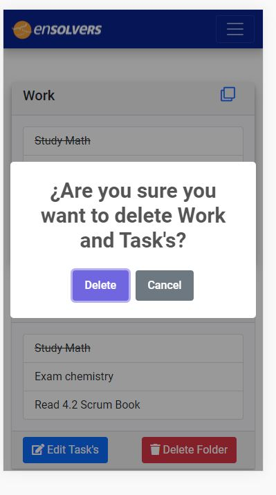

# ToDo App 
##Implementation exercise for Ensolvers
##### By Francisco De Arma
A web app made for Ensolver implementation exercise 

## Built-in
* Angular 13.1.3
  * Bootstrap 5
  * Toastr
  * Fontawesome 5
* Spring 2.6.3
  * JPA
  * H2 DB
  * Lombok
  * JWT
## Pre-requisites
* NPM 8.3.2 (or another version)
* JAVA 11
## Postman Collection
In Rootfolder ToDo.postman_collection.json

######Include the readme for FE and BE
## Demo

